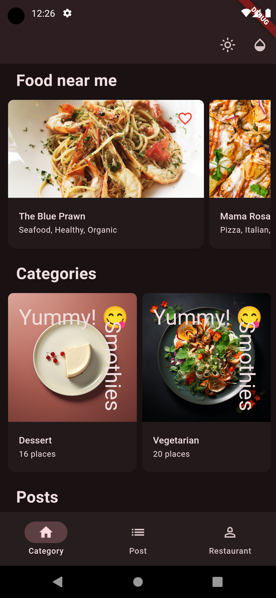
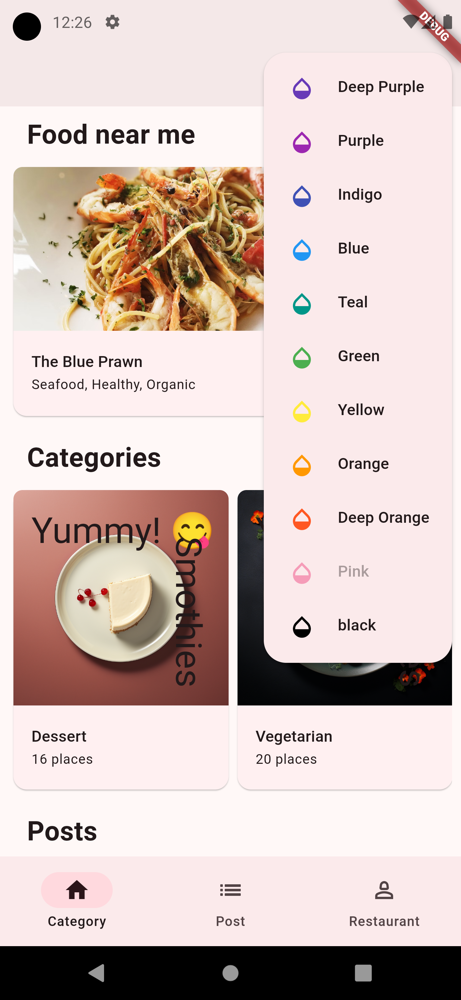
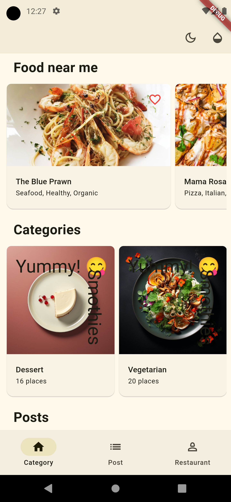
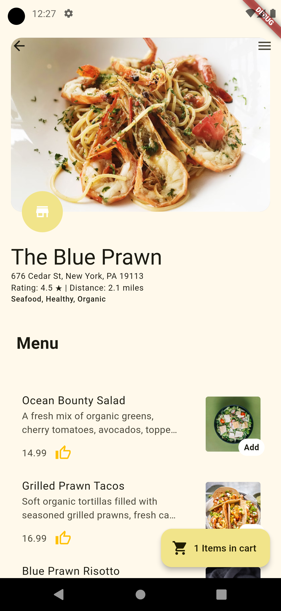
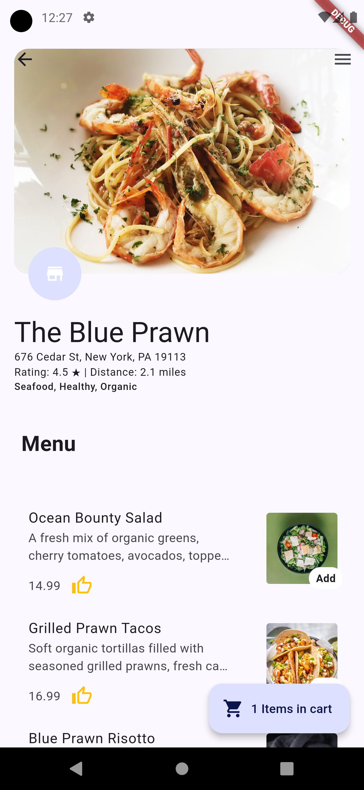
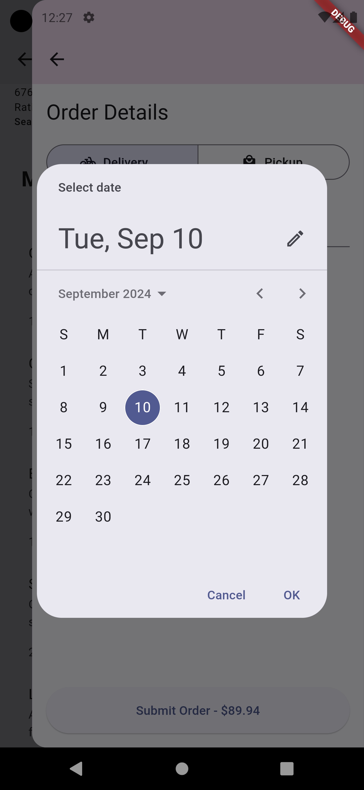

# Fooderlich

## Image Grid with Comments

<table>
  <tr>
    <td>
      
<strong> Dark mode Home page</strong>

      
    </td>
    <td>
      
<strong>Light mode home page</strong>

      
    </td>
    <td>
      
<strong>Changing theme color</strong>

      
    </td>
  </tr>
  <tr>
    <td>
      
<strong>Yellov mode</strong>

      
    </td>
    <td>
      
<strong></strong>

      
    </td>
    <td>
      
<strong>Restaurant page</strong>

      
    </td>
  </tr>
  <tr>
    <td>
      
<strong>Detail bottom sheet </strong>

      
    </td>
    <td>
      
<strong>Order details</strong>

      
    </td>
    <td>
      
<strong> Order Date picker</strong>

      
    </td>
  </tr>
  <tr>
    <td>
      
<strong> Orde Time picker</strong>

      
    </td>
  </tr>
</table>
